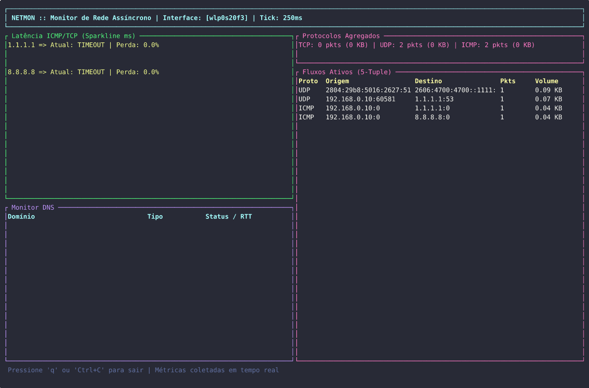

# Netmon — Network Monitor Assíncrono em Rust



Monitor de latência (ICMP com fallback TCP), resolução DNS com medição de RTT
e captura passiva de tráfego com agregação por protocolo e por conexão (5-tuple),
com dashboard TUI ao vivo.

## Limitações honestas da v1

- **ICMP exige privilégio ou `ping_group_range`.** A ordem é: socket DGRAM ICMP
  (sem privilégio) → RAW → fallback TCP connect. Todo resultado via fallback sai
  marcado como `[TCP-Fallback]`, então não há falha silenciosa. Se o kernel
  nega os dois primeiros (`ping_group_range` vazio em muitos containers), sobra
  o TCP. Para ICMP de verdade:

```bash
# opção 1: liberar ICMP sem privilégio para todos os grupos
sudo sysctl -w net.ipv4.ping_group_range="0 2147483647"
# opção 2: dar a capability só ao binário (recomendado)
sudo setcap cap_net_raw,cap_net_admin=eip target/release/netmon
```

- **ICMPv6 implementado** (Echo Request 128 / Reply 129), incluindo checagem de
  ident/seq e buffer com header IPv6 de 40 bytes (socket RAW). O checksum fica
  zerado de propósito: em Linux o kernel sempre calcula o checksum sobre o
  pseudo-header para sockets ICMPv6 (RFC 3542 §11.1) — o endereço de origem só é
  escolhido pela stack no envio, então calculá-lo no userspace seria chute.
- **IPv6 link-local (`fe80::/10`) sem zona de interface** cai no fallback TCP:
  `Send to` precisa de `scope_id`, e `to_socket_addrs` não traz a zona de um
  literal como `fe80::1`.
- **Ident ICMP único por processo** (pid XOR bits do relógio), para que duas
  instâncias do netmon na mesma máquina não aceitem o Echo Reply uma da outra.
- **Lock global no mapa de flows** (`watch.rs`) — medido, não chutado (ver
  seção Benchmark abaixo). Contadores por protocolo são atômicos (sem lock), mas
  o `HashMap` de 5-tuples usa um `RwLock` global. Num teste de contenção com
  1024 fluxos: a 1 thread o lock global faz **6,4 M pacotes/s** e 16 shards
  fazem 5,4 M/s (hash extra + pior localidade — o simples vence); a 8 threads o
  lock global **colapsa para 2,1 M/s** (pior que 1 thread!) e os shards chegam a
  9,3 M/s. Como o design tem **uma thread de captura por interface**, esse
  cenário multi-thread não existe: `DashMap` **não se justifica agora**. O
  gatilho está documentado — se o design migrar para N capturas concorrentes,
  refazer o benchmark e só então trocar.
- **Fluxos mortos são varridos por tempo** (no máximo 1x/min; fluxo sem tráfego
  por 300s é removido) **e** por tamanho (> 10.000 entradas). Antes a limpeza só
  acontecia acima do teto, então abaixo dele flows mortos ficavam para sempre.
- **TUI usa `std::sync::RwLock::try_read`** (não-bloqueante): se a thread de
  captura estiver escrevendo, o tick pula a tabela em vez de travar o executor.
- **Sem números de throughput inventados para a captura real.** O benchmark
  mede o caminho de agregação em userspace (sem NIC e sem parse do `pnet`).
  Para medir de verdade, ponta a ponta: `iperf3` + `netmon watch` lado a lado
  com `tcpdump -i <iface> -q -n`, comparando pps, RSS (`/usr/bin/time -v`) e CPU.

## Benchmark (`cargo bench`)

Caminho medido: `TrafficMetrics::record` (contadores atômicos + mapa de
5-tuples) com 1024 fluxos distintos e pacotes de 1500 B. Máquina: i5-10210U
(8 threads), 8 GB RAM. O `sharded16` é implementado no próprio benchmark
(`benches/flows.rs`) como alternativa hipotética — o código de produção não foi
tocado.

| Cenário | `RwLock` global | 16 shards |
|---|---|---|
| 1 thread (design atual) | **6,4 M pacotes/s** | 5,4 M pacotes/s |
| 2 threads | 3,5 M pacotes/s | **7,2 M pacotes/s** |
| 4 threads | 2,8 M pacotes/s | **9,0 M pacotes/s** |
| 8 threads | 2,1 M pacotes/s | **9,3 M pacotes/s** |

Leitura honesta:

- O lock global **colapsa** sob contenção (8 threads rendem menos que 1).
- Mas hoje há **uma thread de captura por interface**, então a contenção não
  existe — e no cenário real (1 thread) o simples é ~19% mais rápido.
- A 1 thread, 6,4 M pacotes/s × 1500 B ≈ **76 Gbps**: a agregação está 2 ordens
  de grandeza acima de interfaces reais, então não é o gargalo.
- Ressalvas: sintético (sem NIC real, sem parse do `pnet`), `DefaultHasher`
  (SipHash) no modelo sharded — um `DashMap` com hasher rápido renderia um
  pouco mais. O gatilho de troca continua valendo: N capturas concorrentes.
- Extra (micro, irrelevante para throughput): checksum ICMPv4 de 12 bytes em
  ~8 ns.

## Privilégios (decisão de design, não bug)

- **Ping ICMP/ICMPv6:** tenta socket DGRAM (sem privilégio) → RAW. Sem permissão
  → fallback TCP connect (marcado `[TCP-Fallback]`).
- **Captura datalink (`pnet`):** exige `CAP_NET_RAW`. Em produção, nunca `sudo`:

```bash
cargo build --release
sudo setcap cap_net_raw,cap_net_admin=eip target/release/netmon
./target/release/netmon dashboard
```

> Em ambientes sem root e sem `CAP_NET_RAW` (containers com
> `ping_group_range` vazio, por exemplo), todo ping sai como `[TCP-Fallback]`.
> É o caminho projetado, não um bug — a medição continua válida para latência
> de handshake TCP.

## Uso

```bash
netmon dashboard --ping-hosts "1.1.1.1,8.8.8.8" --dns-domains "github.com,cloudflare.com"
netmon dashboard --ping-interval 500 --ping-timeout 1000   # knobs do dashboard
netmon ping 1.1.1.1 8.8.8.8 --interval 1000
netmon ping 2606:4700:4700::1111                            # ICMPv6
netmon dns cloudflare.com archlinux.org --record-type a
netmon watch --interface eth0 --interval 1000
# validar lado a lado: sudo tcpdump -i eth0 -q -n
```

## Testes (Fase 6)

```bash
cargo test
```

Cobre: perda total/parcial (`PingStats`), checksum ICMPv4 calculado,
rejeição de ICMP type/id errado, host inalcançável sem panic,
domínio inexistente como estado, contadores do watcher, histórico da TUI,
e (v2) construção/validação de Echo Request/Reply **ICMPv6** (tipo 128/129,
ident/seq, buffer com header IPv6), estabilidade do ident por processo,
predicado de flow morto, agendamento da varredura periódica e o backstop por
tamanho do mapa de flows.
